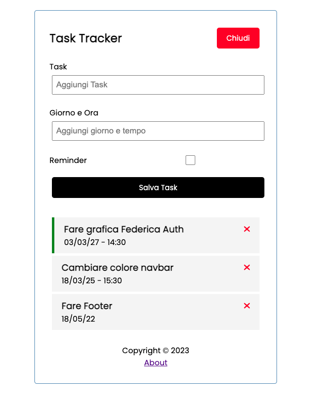

# Task Tracker

SPA per per tener traccia dei propri task realizzata con Angular 15.
- CRUD - Creazione task, Lista dei task, Modifica Task (con doppio click) ed Eliminazione task
- Usata libreria Json-Server per creare delle fake Rest Api
- FontAwesome per le icone

Progetto generato con [Angular CLI](https://github.com/angular/angular-cli) versione 15.2.1.

## Development server

Da terminale dopo aver fatto `npm install` lancia `ng serve -o` e `npm run server` in un altro terminale per avviare l'app.

N.B: Devi aver installato globalmente Angular-Cli

## INFO
Il "db" è visibile nella root nel file `db.json.`\
Grazie al modulo http di Angular (no axios, no fetch) ed i services aggiorniamo i dati all'interno del file in modo che le modifiche siano permanenti anche al refresh della pagina.\
Utilizzato Typescript, Services, Observer, Interfaces.

## OPNIONI PERSONALI
Angular risulta più complesso e robusto di altri frameworks, risulta più "restrittivo". Ci sono varie differenze (ho lasciato dei commenti per il codice).\
Ha senso usarlo per grandi applicativi che devono scalare ma non lo preferisco e per un progetto personale, per un free-lancer o per una startup Angular potrebbe **NON** essere la scelta migliore.
Il mio framewrok preferito rimane Vue.js.\
La stessa SPA fatta con Vue avrebbe richiesto la metà del tempo.

